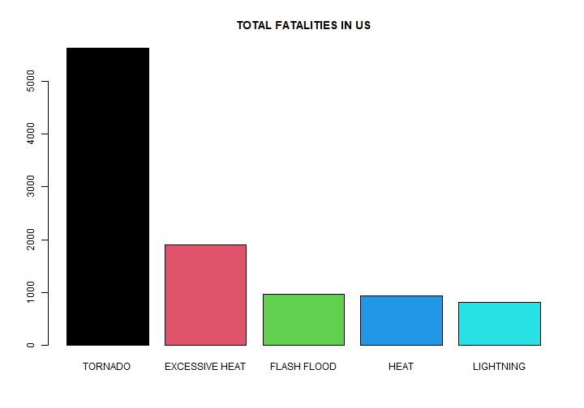
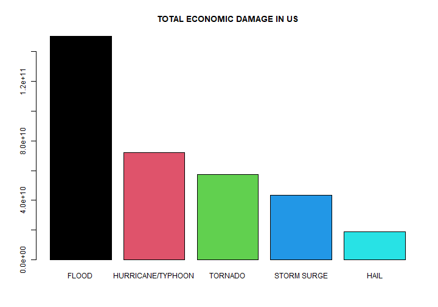

# Human and Economic loss analysis from Storm Data

## Synopsis

This is a report on the analysis of the various types of natural disasters in the US. This report finds which types of the calamity have causes maximum human fatalities and injuries. Analysis of economic damage by the various calamities has also been analyzed. Tornado, Excessive Heat, Flash Flood, Heat and Lightening causes the most human fatalities. Flood, Hurricane/Typhoon, Tornado, Storm SUrge and Hail are the top five type of disasters that have caused maximum economic damage. Economic damage has been calculated as sum of both property damage and crop damage.


```r
data <- read.csv("repdata_data_StormData.csv.bz2")

head(data)
```

```
##   STATE__           BGN_DATE BGN_TIME TIME_ZONE COUNTY COUNTYNAME STATE  EVTYPE BGN_RANGE BGN_AZI BGN_LOCATI END_DATE
## 1       1  4/18/1950 0:00:00     0130       CST     97     MOBILE    AL TORNADO         0                            
## 2       1  4/18/1950 0:00:00     0145       CST      3    BALDWIN    AL TORNADO         0                            
## 3       1  2/20/1951 0:00:00     1600       CST     57    FAYETTE    AL TORNADO         0                            
## 4       1   6/8/1951 0:00:00     0900       CST     89    MADISON    AL TORNADO         0                            
## 5       1 11/15/1951 0:00:00     1500       CST     43    CULLMAN    AL TORNADO         0                            
## 6       1 11/15/1951 0:00:00     2000       CST     77 LAUDERDALE    AL TORNADO         0                            
##   END_TIME COUNTY_END COUNTYENDN END_RANGE END_AZI END_LOCATI LENGTH WIDTH F MAG FATALITIES INJURIES PROPDMG PROPDMGEXP
## 1                   0         NA         0                      14.0   100 3   0          0       15    25.0          K
## 2                   0         NA         0                       2.0   150 2   0          0        0     2.5          K
## 3                   0         NA         0                       0.1   123 2   0          0        2    25.0          K
## 4                   0         NA         0                       0.0   100 2   0          0        2     2.5          K
## 5                   0         NA         0                       0.0   150 2   0          0        2     2.5          K
## 6                   0         NA         0                       1.5   177 2   0          0        6     2.5          K
##   CROPDMG CROPDMGEXP WFO STATEOFFIC ZONENAMES LATITUDE LONGITUDE LATITUDE_E LONGITUDE_ REMARKS REFNUM
## 1       0                                         3040      8812       3051       8806              1
## 2       0                                         3042      8755          0          0              2
## 3       0                                         3340      8742          0          0              3
## 4       0                                         3458      8626          0          0              4
## 5       0                                         3412      8642          0          0              5
## 6       0                                         3450      8748          0          0              6
```

```r
str(data)
```

```
## 'data.frame':	902297 obs. of  37 variables:
##  $ STATE__   : num  1 1 1 1 1 1 1 1 1 1 ...
##  $ BGN_DATE  : chr  "4/18/1950 0:00:00" "4/18/1950 0:00:00" "2/20/1951 0:00:00" "6/8/1951 0:00:00" ...
##  $ BGN_TIME  : chr  "0130" "0145" "1600" "0900" ...
##  $ TIME_ZONE : chr  "CST" "CST" "CST" "CST" ...
##  $ COUNTY    : num  97 3 57 89 43 77 9 123 125 57 ...
##  $ COUNTYNAME: chr  "MOBILE" "BALDWIN" "FAYETTE" "MADISON" ...
##  $ STATE     : chr  "AL" "AL" "AL" "AL" ...
##  $ EVTYPE    : chr  "TORNADO" "TORNADO" "TORNADO" "TORNADO" ...
##  $ BGN_RANGE : num  0 0 0 0 0 0 0 0 0 0 ...
##  $ BGN_AZI   : chr  "" "" "" "" ...
##  $ BGN_LOCATI: chr  "" "" "" "" ...
##  $ END_DATE  : chr  "" "" "" "" ...
##  $ END_TIME  : chr  "" "" "" "" ...
##  $ COUNTY_END: num  0 0 0 0 0 0 0 0 0 0 ...
##  $ COUNTYENDN: logi  NA NA NA NA NA NA ...
##  $ END_RANGE : num  0 0 0 0 0 0 0 0 0 0 ...
##  $ END_AZI   : chr  "" "" "" "" ...
##  $ END_LOCATI: chr  "" "" "" "" ...
##  $ LENGTH    : num  14 2 0.1 0 0 1.5 1.5 0 3.3 2.3 ...
##  $ WIDTH     : num  100 150 123 100 150 177 33 33 100 100 ...
##  $ F         : int  3 2 2 2 2 2 2 1 3 3 ...
##  $ MAG       : num  0 0 0 0 0 0 0 0 0 0 ...
##  $ FATALITIES: num  0 0 0 0 0 0 0 0 1 0 ...
##  $ INJURIES  : num  15 0 2 2 2 6 1 0 14 0 ...
##  $ PROPDMG   : num  25 2.5 25 2.5 2.5 2.5 2.5 2.5 25 25 ...
##  $ PROPDMGEXP: chr  "K" "K" "K" "K" ...
##  $ CROPDMG   : num  0 0 0 0 0 0 0 0 0 0 ...
##  $ CROPDMGEXP: chr  "" "" "" "" ...
##  $ WFO       : chr  "" "" "" "" ...
##  $ STATEOFFIC: chr  "" "" "" "" ...
##  $ ZONENAMES : chr  "" "" "" "" ...
##  $ LATITUDE  : num  3040 3042 3340 3458 3412 ...
##  $ LONGITUDE : num  8812 8755 8742 8626 8642 ...
##  $ LATITUDE_E: num  3051 0 0 0 0 ...
##  $ LONGITUDE_: num  8806 0 0 0 0 ...
##  $ REMARKS   : chr  "" "" "" "" ...
##  $ REFNUM    : num  1 2 3 4 5 6 7 8 9 10 ...
```

## Data Processing

Quick check for the NA (missing) values. 
0 in output suggests that number of missing values in that particular column is 0.


```r
sum(is.na(data$PROPDMG))
```

```
## [1] 0
```

```r
sum(is.na(data$PROPDMGEXP))
```

```
## [1] 0
```

```r
sum(is.na(data$CROPDMG))
```

```
## [1] 0
```

```r
sum(is.na(data$CROPDMGEXP))
```

```
## [1] 0
```

Below code is for processing the loss from three significant digits and exponential to actual decimal figures. We need to convert the data into actual numeric figures for summation.


```r
foo <- data$PROPDMGEXP == "K" | data$PROPDMGEXP == "k"
data$PROPDMG[foo] <- data$PROPDMG[foo] * 1000

foo <- data$PROPDMGEXP == "M" | data$PROPDMGEXP == "m"
data$PROPDMG[foo] <- data$PROPDMG[foo] * 1000000

foo <- data$PROPDMGEXP == "B" | data$PROPDMGEXP == "b"
data$PROPDMG[foo] <- data$PROPDMG[foo] * 1000000000

foo <- data$PROPDMGEXP == "H" | data$PROPDMGEXP == "h"
data$PROPDMG[foo] <- data$PROPDMG[foo] * 100

foo <- data$PROPDMGEXP == "+"
data$PROPDMG[foo] <- data$PROPDMG[foo] * 10

foo <- data$PROPDMGEXP >= "0" & data$PROPDMGEXP <= "8"
data$PROPDMG[foo] <- data$PROPDMG[foo] * 10
```

Same process for the crop loss


```r
foo <- data$CROPDMGEXP == "K" | data$CROPDMGEXP == "k"
data$CROPDMG[foo] <- data$CROPDMG[foo] * 1000

foo <- data$CROPDMGEXP == "M" | data$CROPDMGEXP == "m"
data$CROPDMG[foo] <- data$CROPDMG[foo] * 1000000

foo <- data$CROPDMGEXP == "B" | data$CROPDMGEXP == "b"
data$CROPDMG[foo] <- data$CROPDMG[foo] * 1000000000

foo <- data$CROPDMGEXP == "H" | data$CROPDMGEXP == "h"
data$CROPDMG[foo] <- data$CROPDMG[foo] * 100

foo <- data$CROPDMGEXP == "+"
data$CROPDMG[foo] <- data$CROPDMG[foo] * 10

foo <- data$CROPDMGEXP >= "0" & data$CROPDMGEXP <= "8"
data$CROPDMG[foo] <- data$CROPDMG[foo] * 10
```

## Results

Quick check again for missing values


```r
sum(is.na(data$EVTYPE))
```

```
## [1] 0
```

```r
sum(is.na(data$FATALITIES))
```

```
## [1] 0
```

```r
sum(is.na(data$INJURIES))
```

```
## [1] 0
```

Summing the data for various instances of each disaster


```r
fatalities <- aggregate(FATALITIES~EVTYPE,data,sum)
injuries <- aggregate(INJURIES~EVTYPE,data,sum)
health_effect <- merge(fatalities,injuries,by="EVTYPE")
```

TOP 20 fatality causing disasters


```r
health_effect <- health_effect[order(health_effect$FATALITIES,health_effect$INJURIES,decreasing = TRUE),]
health_effect[1:20,]
```

```
##                      EVTYPE FATALITIES INJURIES
## 834                 TORNADO       5633    91346
## 130          EXCESSIVE HEAT       1903     6525
## 153             FLASH FLOOD        978     1777
## 275                    HEAT        937     2100
## 464               LIGHTNING        816     5230
## 856               TSTM WIND        504     6957
## 170                   FLOOD        470     6789
## 585             RIP CURRENT        368      232
## 359               HIGH WIND        248     1137
## 19                AVALANCHE        224      170
## 972            WINTER STORM        206     1321
## 586            RIP CURRENTS        204      297
## 278               HEAT WAVE        172      309
## 140            EXTREME COLD        160      231
## 760       THUNDERSTORM WIND        133     1488
## 310              HEAVY SNOW        127     1021
## 141 EXTREME COLD/WIND CHILL        125       24
## 676             STRONG WIND        103      280
## 30                 BLIZZARD        101      805
## 350               HIGH SURF        101      152
```

Top 5 fatality causing disasters plot


```r
with(health_effect[1:5,],barplot(FATALITIES,col = 1:5,names.arg=EVTYPE))
title("TOTAL FATALITIES IN US")
```



Calculating the economic cost of each disaster


```r
econ_damage <- data$PROPDMG + data$CROPDMG
data <- cbind(data,econ_damage)
```

TOP 20 economic damage causing disasters


```r
economic_damage <- aggregate(econ_damage~EVTYPE,data,sum)
economic_damage <- economic_damage[order(economic_damage$econ_damage,decreasing = TRUE),]
economic_damage[1:20,]
```

```
##                        EVTYPE  econ_damage
## 170                     FLOOD 150319678257
## 411         HURRICANE/TYPHOON  71913712800
## 834                   TORNADO  57352118150
## 670               STORM SURGE  43323541000
## 244                      HAIL  18758224587
## 153               FLASH FLOOD  17562132318
## 95                    DROUGHT  15018672000
## 402                 HURRICANE  14610229010
## 590               RIVER FLOOD  10148404500
## 427                 ICE STORM   8967041810
## 848            TROPICAL STORM   8382236550
## 972              WINTER STORM   6715441260
## 359                 HIGH WIND   5908617775
## 957                  WILDFIRE   5060586800
## 856                 TSTM WIND   5038936340
## 671          STORM SURGE/TIDE   4642038000
## 760         THUNDERSTORM WIND   3897965612
## 409            HURRICANE OPAL   3191846000
## 955          WILD/FOREST FIRE   3108626330
## 298 HEAVY RAIN/SEVERE WEATHER   2500000000
```

TOP 5 economic damage causing disasters plot


```r
with(economic_damage[1:5,],barplot(econ_damage,col=1:5,names.arg = EVTYPE))
title("TOTAL ECONOMIC DAMAGE IN US")
```


